# 🏦 Machine Learning Studio — Trading, Arbitrage & DeFi

> Enterprise-grade distributed platform for algorithmic trading, on-chain arbitrage, and DeFi services, powered by machine learning.

[](https://github.com/somat3k/configs-repo/actions/workflows/ci.yml)
[](https://somat3k.github.io/configs-repo)
[](LICENSE)

---

## ⚡ Live Workflow Examples

Each module ships a **standalone, user-loadable workflow page** (`src/workflow-demo/`) built on ASP.NET Core + Blazor Server.  
Run it with a single command and open any `/workflow/{module}` URL to see the functional data pipeline in action:

```bash
dotnet run --project src/workflow-demo/MLS.WorkflowDemo
# → http://localhost:5099/workflow
```

> The pages connect to Hyperliquid and DeFi Llama for live data. A built-in market snapshot is used automatically when external APIs are unreachable (e.g. CI).

### 📸 Workflow Screenshots

| | |
|:---:|:---:|
| **Workflow Index** — module gallery with ports & descriptions | **Block Controller** — module registry + live Hyperliquid prices |
| [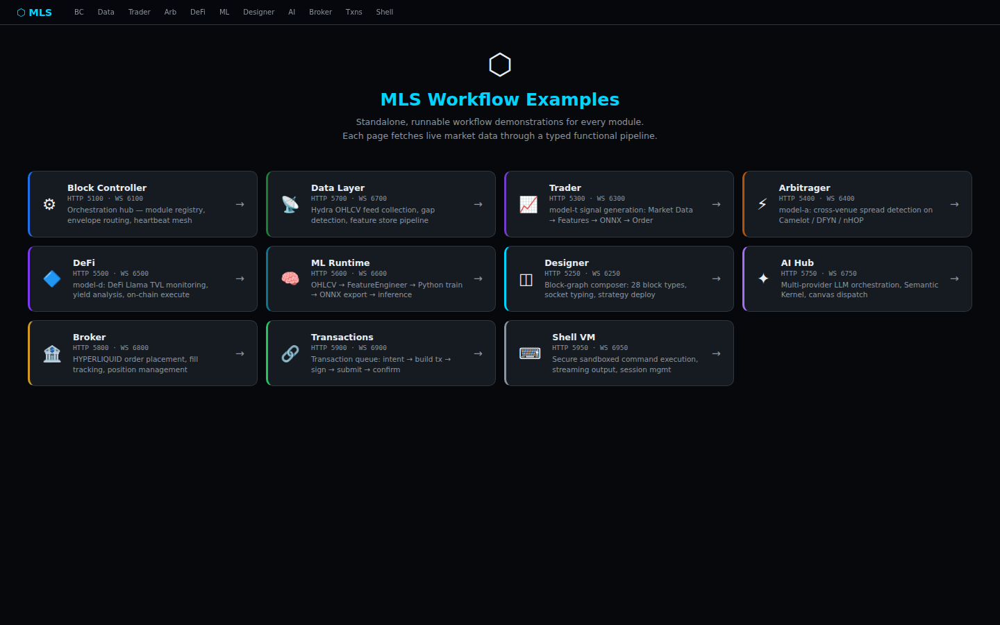](docs/screenshots/index.png) | [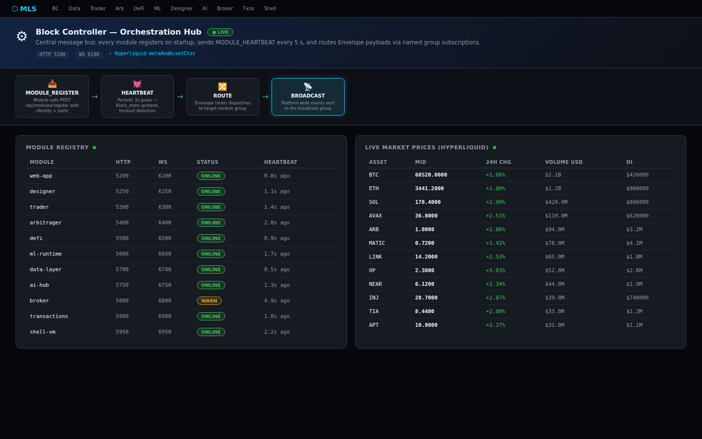](docs/screenshots/block-controller.png) |
| **Data Layer** — 1m OHLCV feed + 8-dim FeatureVector (RSI, MACD, BB…) | **Trader** — model-t signal pipeline: Features → ONNX → BUY/HOLD/SELL |
| [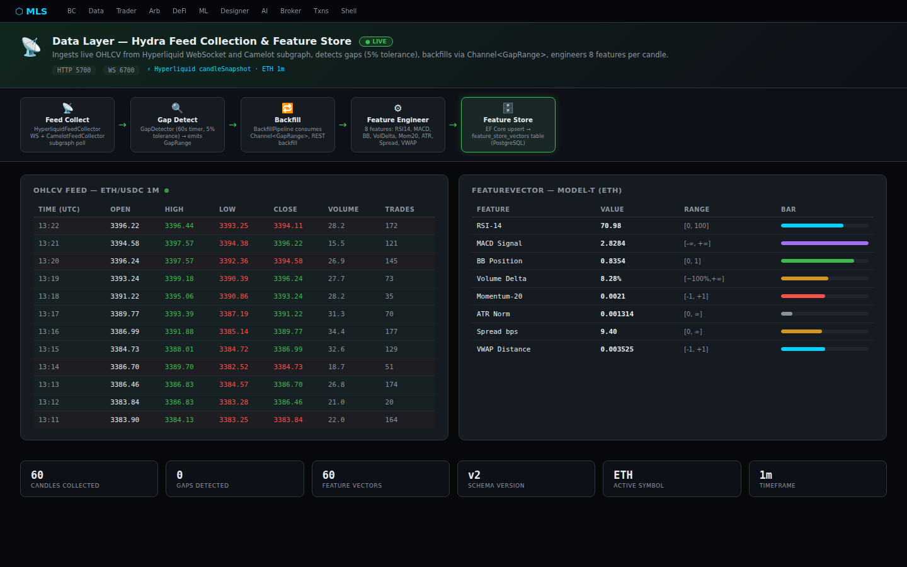](docs/screenshots/data-layer.png) | [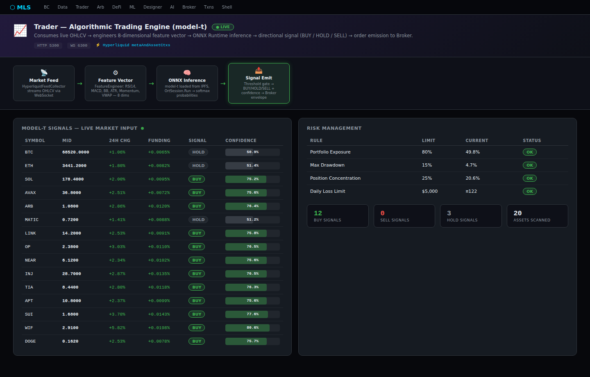](docs/screenshots/trader.png) |
| **Arbitrager** — Camelot · DFYN · nHOP · Hyperliquid spread scan | **DeFi** — DeFi Llama TVL + yield opportunities (Balancer, Morpho) |
| [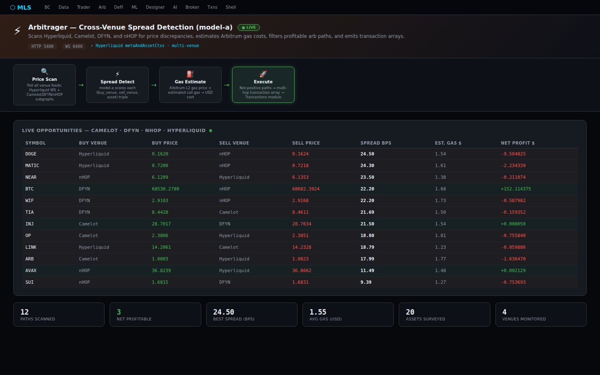](docs/screenshots/arbitrager.png) | [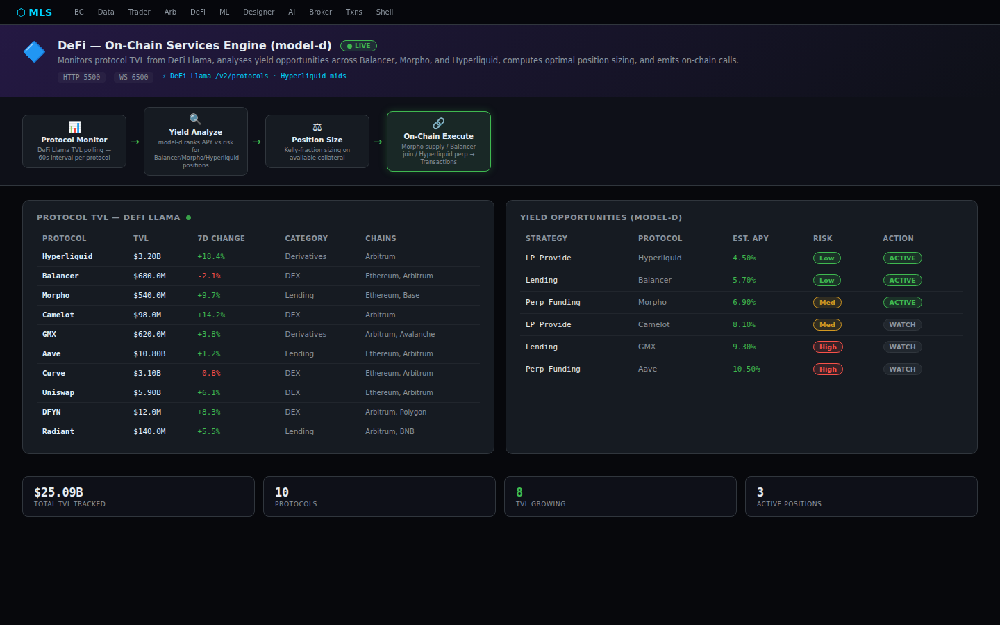](docs/screenshots/defi.png) |
| **ML Runtime** — OHLCV → FeatureEngineer → Python train → ONNX export | **Designer** — 28-type block graph: sockets, strategy deploy, Roslyn |
| [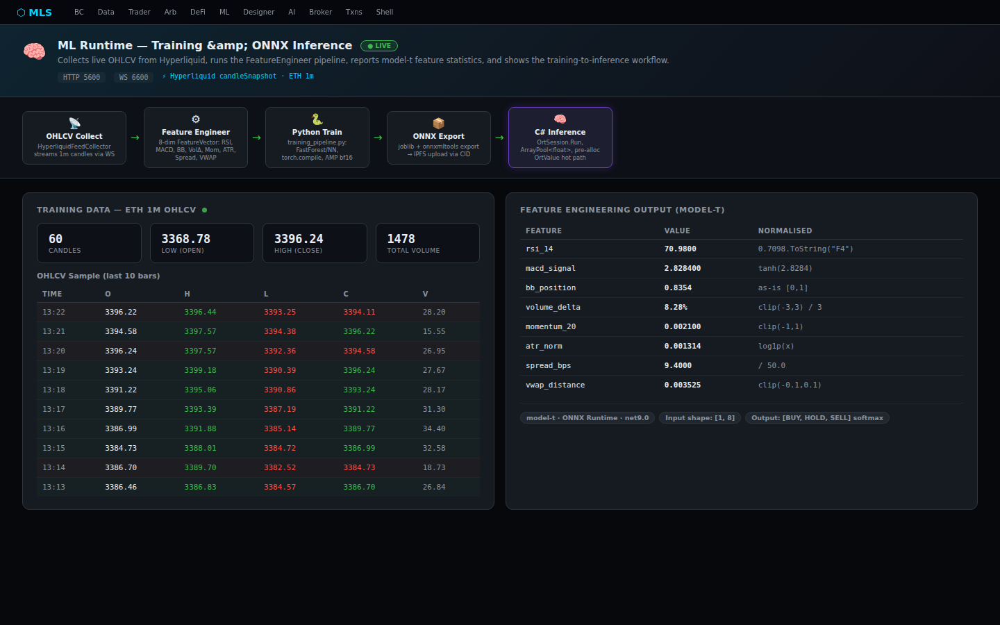](docs/screenshots/ml-runtime.png) | [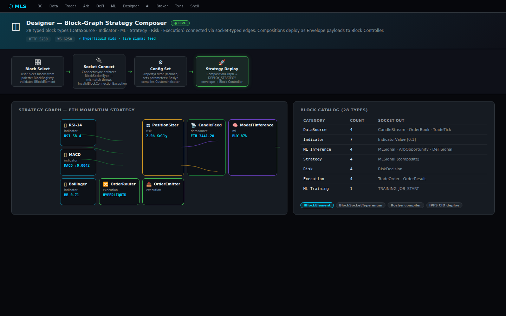](docs/screenshots/designer.png) |
| **AI Hub** — 7 LLM providers, Semantic Kernel, live market context | **Broker** — HYPERLIQUID order routing + fill tracking |
| [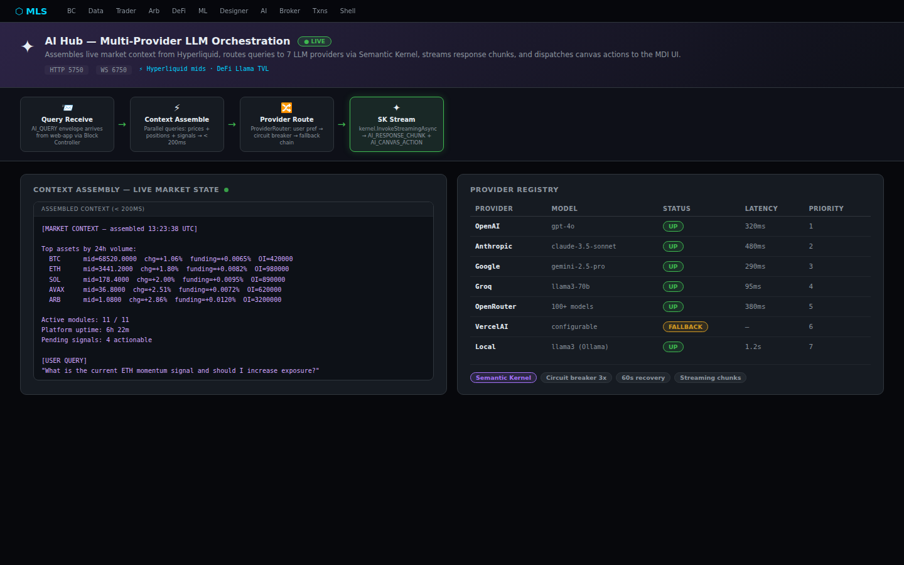](docs/screenshots/ai-hub.png) | [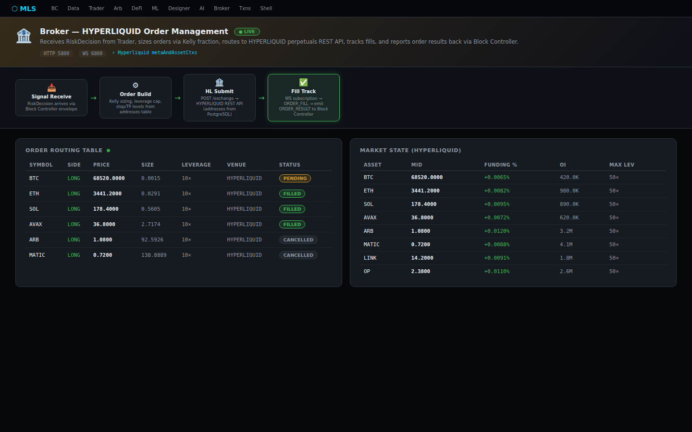](docs/screenshots/broker.png) |
| **Transactions** — EIP-1559 build → sign → Arbitrum L2 submit | **Shell VM** — secure sandboxed CLI with output streaming |
| [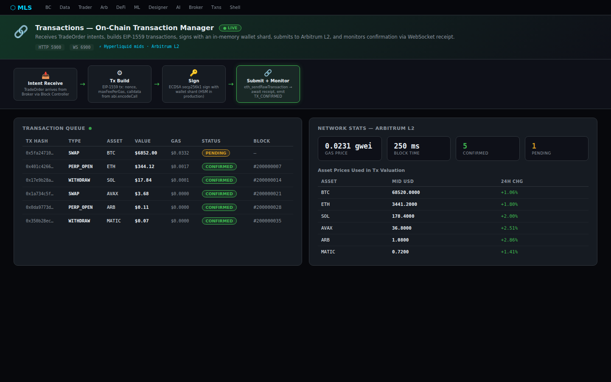](docs/screenshots/transactions.png) | [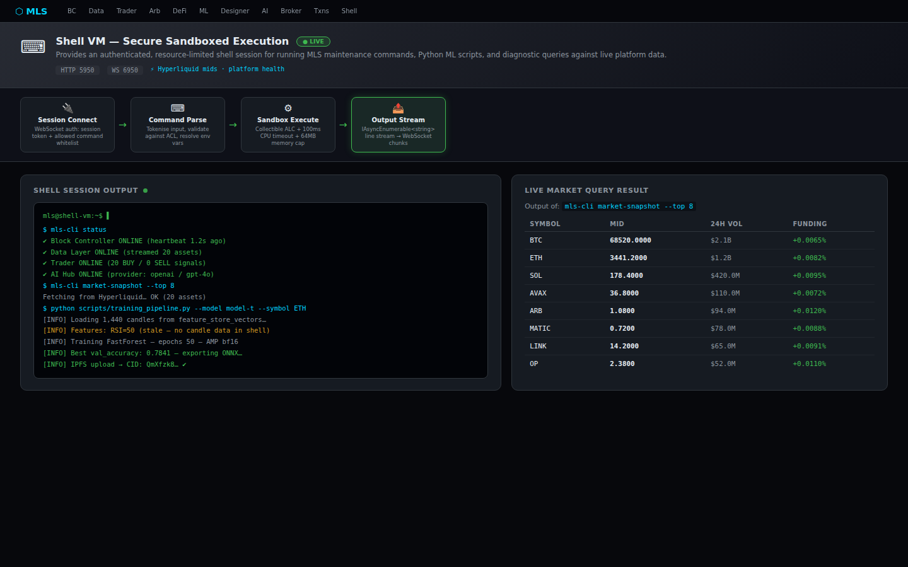](docs/screenshots/shell-vm.png) |

Each workflow page is **self-contained**: it fetches live data, runs the same functional pipeline used in production, and renders the result — no other services required.

---

## 🏗️ Architecture Overview

> For the canonical platform diagram, module inventory, and startup details, see the primary **Architecture Overview** and **Modules** sections later in this README. This avoids maintaining duplicate documentation blocks in multiple places.
| [transactions](src/modules/transactions/README.md) | 5900/6900 | Transaction manager | 🔧 Scaffold |
| [network-modules](src/network-modules/README.md) | — | ID gen, registry, runtime, VM | 🔧 Scaffold |
| **[workflow-demo](src/workflow-demo/MLS.WorkflowDemo/)** | **5099** | **Standalone workflow examples (this session)** | ✅ **New** |

## 🚀 Quick Start

### Prerequisites
- .NET 9 SDK
- Docker Desktop
- Node.js 20+
- Python 3.12+

### 1. Start Infrastructure
```bash
docker compose -f docker-compose.infra.yml up -d
```

### 2. Start All Modules (Development)
```bash
# Using .NET Aspire (once src/MLS.AppHost is scaffolded)
# dotnet run --project src/MLS.AppHost

# Or individual modules via VS Code tasks
# Press Ctrl+Shift+P → "Tasks: Run Task" → "🚀 Full Stack (All Modules)"
```

### 3. Open Web App
Navigate to `https://localhost:7200`

### 4. Workflow Demo (Standalone)
```bash
dotnet run --project src/workflow-demo/MLS.WorkflowDemo
# Open http://localhost:5099/workflow
```

### 5. Documentation Site (NuxtJS)
```bash
cd nuxt-pages && npm install && npm run dev
# Open http://localhost:3000
```

## 🧠 Skills (GitHub Copilot)

Skills are in `.skills/` — they guide Copilot code generation for this project:

| Skill | Description |
|-------|-------------|
| [dotnet-devs](.skills/dotnet-devs.md) | C#/.NET best practices |
| [web-apps](.skills/web-apps.md) | ASP.NET Core / Blazor patterns |
| [premium-uiux-blazor](.skills/premium-uiux-blazor.md) | FluentUI Blazor, MDI canvas, charts |
| [system-architect](.skills/system-architect.md) | Module topology, envelope protocol |
| [web3](.skills/web3.md) | HYPERLIQUID, DeFi, on-chain transactions |
| [machine-learning](.skills/machine-learning.md) | ONNX, JOBLIB, neural networks |
| [python](.skills/python.md) | ML training scripts, pipelines |
| [networking](.skills/networking.md) | .NET Aspire, WebSocket mesh |
| [storage-data-management](.skills/storage-data-management.md) | PostgreSQL, Redis, IPFS |
| [websockets-inferences](.skills/websockets-inferences.md) | SignalR, streaming, payload schemas |
| [beast-development](.skills/beast-development.md) | High-performance, low-latency patterns |
| [artificial-intelligence](.skills/artificial-intelligence.md) | Semantic Kernel, ONNX inference |
| [agents](.skills/agents.md) | Module agents, orchestration |
| [designer](.skills/designer.md) | Block graph, socket types, composition, schema versioning |
| [ai-hub](.skills/ai-hub.md) | SK plugin patterns, provider routing, canvas actions |
| [pwa-chrome](.skills/pwa-chrome.md) | PWA manifest, Workbox SW, Chrome MV3 extension |
| [exchange-adapters](.skills/exchange-adapters.md) | IExchangeAdapter, Nethereum, Arbitrum DEX specifics |
| [hydra-collector](.skills/hydra-collector.md) | Feed collectors, gap detection, backfill pipeline |

## 📋 Checklists

- [CHECKLIST.md](CHECKLIST.md) — Extensive test, debug, and development checklist

## 🗂️ Repository Structure

```
configs-repo/
├── .github/
│   ├── copilot-instructions.md     # Copilot project instructions
│   ├── workflows/                  # CI/CD pipelines
│   └── copilot-rules/              # Domain-specific copilot rules
├── .skills/                        # GitHub Copilot skills (from awesome-copilot)
├── .vscode/                        # VS Code settings, tasks, launch configs
├── src/
│   ├── MLS.AppHost/                # .NET Aspire orchestration
│   ├── MLS.Core/                   # Shared contracts and constants
│   ├── block-controller/           # Root orchestration module
│   ├── web-app/                    # Blazor web application
│   ├── modules/
│   │   ├── trader/                 # Trader algo-model
│   │   ├── arbitrager/             # Arbitrager algo-model
│   │   ├── defi/                   # DeFi services
│   │   ├── ml-runtime/             # ML training & inference (Python + C#)
│   │   ├── data-layer/             # Data-driven access layer
│   │   ├── broker/                 # Broker integration
│   │   └── transactions/           # Transaction management
│   ├── network-modules/            # Network infrastructure modules
│   └── workflow-demo/              # ✅ Standalone workflow example pages (NEW)
│       └── MLS.WorkflowDemo/       #    dotnet run → http://localhost:5099/workflow
├── nuxt-pages/                     # GitHub Pages documentation (NuxtJS)
├── infra/                          # Infrastructure configs
│   ├── postgres/init/              # PostgreSQL init scripts
│   └── redis/                      # Redis config
├── docs/
│   ├── architecture/               # Architecture documentation
│   └── screenshots/                # ✅ Workflow screenshots (NEW)
├── artifacts/                      # ML model artifacts (gitignored)
├── docker-compose.yml              # Full platform
├── docker-compose.infra.yml        # Infrastructure only
└── MLS.sln                         # Solution file
```

## 🤝 Contributing

See [docs/CONTRIBUTING.md](docs/CONTRIBUTING.md) for development guidelines.

## 📜 License

MIT License — see [LICENSE](LICENSE)

## 🏗️ Architecture Overview

```
┌─────────────────── Web App (Blazor MDI) ──────────────────────┐
│   Trader │ Arbitrager │ DeFi │ Network │ Observatory │ Config  │
└───────────────────────┬───────────────────────────────────────┘
                        │ SignalR/WebSocket
          ┌─────────────▼──────────────┐
          │     Block Controller       │  ← Orchestration Hub
          │      (port 5100/6100)      │
          └──────┬────────┬────────────┘
      ┌──────────┤        └────────────────┐
      │          │                         │
 ┌────▼───┐ ┌───▼────┐ ┌───────┐ ┌───────▼──────┐
 │ Trader │ │  Arb   │ │ DeFi  │ │  ML Runtime  │
 │  5300  │ │  5400  │ │ 5500  │ │   5600/6600  │
 └────────┘ └────────┘ └───────┘ └──────────────┘
          │          │         │
     ┌────▼──────────▼─────────▼────┐
     │        Data-Driven Layer     │
     │  PostgreSQL │ Redis │  IPFS  │
     └──────────────────────────────┘
```

## 📦 Modules

| Module | Port (HTTP/WS) | Role | Status |
|--------|----------------|------|--------|
| [block-controller](src/block-controller/README.md) | 5100/6100 | Orchestration hub | ✅ Active |
| [web-app](src/web-app/README.md) | 5200/6200 | Blazor MDI UI | ✅ Active |
| [designer](src/modules/designer/README.md) | 5250/6250 | Block graph composer | ✅ Active |
| [trader](src/modules/trader/README.md) | 5300/6300 | Algo trading model | 🔧 Scaffold |
| [arbitrager](src/modules/arbitrager/README.md) | 5400/6400 | Arbitrage model | 🔧 Scaffold |
| [defi](src/modules/defi/README.md) | 5500/6500 | DeFi services | 🔧 Scaffold |
| [ml-runtime](src/modules/ml-runtime/README.md) | 5600/6600 | ML training & inference | 🔧 Scaffold |
| [data-layer](src/modules/data-layer/README.md) | 5700/6700 | Hydra OHLCV feed collection, gap detection, backfill | ✅ Active |
| [ai-hub](src/modules/ai-hub/README.md) | 5750/6750 | AI chat & canvas dispatch | ✅ Active |
| [broker](src/modules/broker/README.md) | 5800/6800 | Broker integration (HYPERLIQUID) | 🔧 Scaffold |
| [transactions](src/modules/transactions/README.md) | 5900/6900 | Transaction manager | 🔧 Scaffold |
| [network-modules](src/network-modules/README.md) | — | ID gen, registry, runtime, VM | 🔧 Scaffold |

## 🚀 Quick Start

### Prerequisites
- .NET 9 SDK
- Docker Desktop
- Node.js 20+
- Python 3.12+

### 1. Start Infrastructure
```bash
docker compose -f docker-compose.infra.yml up -d
```

### 2. Start All Modules (Development)
```bash
# Using .NET Aspire (once src/MLS.AppHost is scaffolded)
# dotnet run --project src/MLS.AppHost

# Or individual modules via VS Code tasks
# Press Ctrl+Shift+P → "Tasks: Run Task" → "🚀 Full Stack (All Modules)"
```

### 3. Open Web App
Navigate to `https://localhost:7200`

### 4. Documentation Site (NuxtJS)
```bash
cd nuxt-pages && npm install && npm run dev
# Open http://localhost:3000
```

## 🧠 Skills (GitHub Copilot)

Skills are in `.skills/` — they guide Copilot code generation for this project:

| Skill | Description |
|-------|-------------|
| [dotnet-devs](.skills/dotnet-devs.md) | C#/.NET best practices |
| [web-apps](.skills/web-apps.md) | ASP.NET Core / Blazor patterns |
| [premium-uiux-blazor](.skills/premium-uiux-blazor.md) | FluentUI Blazor, MDI canvas, charts |
| [system-architect](.skills/system-architect.md) | Module topology, envelope protocol |
| [web3](.skills/web3.md) | HYPERLIQUID, DeFi, on-chain transactions |
| [machine-learning](.skills/machine-learning.md) | ONNX, JOBLIB, neural networks |
| [python](.skills/python.md) | ML training scripts, pipelines |
| [networking](.skills/networking.md) | .NET Aspire, WebSocket mesh |
| [storage-data-management](.skills/storage-data-management.md) | PostgreSQL, Redis, IPFS |
| [websockets-inferences](.skills/websockets-inferences.md) | SignalR, streaming, payload schemas |
| [beast-development](.skills/beast-development.md) | High-performance, low-latency patterns |
| [artificial-intelligence](.skills/artificial-intelligence.md) | Semantic Kernel, ONNX inference |
| [agents](.skills/agents.md) | Module agents, orchestration |
| [designer](.skills/designer.md) | Block graph, socket types, composition, schema versioning |
| [ai-hub](.skills/ai-hub.md) | SK plugin patterns, provider routing, canvas actions |
| [pwa-chrome](.skills/pwa-chrome.md) | PWA manifest, Workbox SW, Chrome MV3 extension |
| [exchange-adapters](.skills/exchange-adapters.md) | IExchangeAdapter, Nethereum, Arbitrum DEX specifics |
| [hydra-collector](.skills/hydra-collector.md) | Feed collectors, gap detection, backfill pipeline |

## 📋 Checklists

- [CHECKLIST.md](CHECKLIST.md) — Extensive test, debug, and development checklist

## 🗂️ Repository Structure

```
configs-repo/
├── .github/
│   ├── copilot-instructions.md     # Copilot project instructions
│   ├── workflows/                  # CI/CD pipelines
│   └── copilot-rules/              # Domain-specific copilot rules
├── .skills/                        # GitHub Copilot skills (from awesome-copilot)
├── .vscode/                        # VS Code settings, tasks, launch configs
├── src/
│   ├── MLS.AppHost/                # .NET Aspire orchestration
│   ├── MLS.Core/                   # Shared contracts and constants
│   ├── block-controller/           # Root orchestration module
│   ├── web-app/                    # Blazor web application
│   ├── modules/
│   │   ├── trader/                 # Trader algo-model
│   │   ├── arbitrager/             # Arbitrager algo-model
│   │   ├── defi/                   # DeFi services
│   │   ├── ml-runtime/             # ML training & inference (Python + C#)
│   │   ├── data-layer/             # Data-driven access layer
│   │   ├── broker/                 # Broker integration
│   │   └── transactions/           # Transaction management
│   └── network-modules/            # Network infrastructure modules
├── nuxt-pages/                     # GitHub Pages documentation (NuxtJS)
├── infra/                          # Infrastructure configs
│   ├── postgres/init/              # PostgreSQL init scripts
│   └── redis/                      # Redis config
├── docs/                           # Architecture documentation
├── artifacts/                      # ML model artifacts (gitignored)
├── docker-compose.yml              # Full platform
├── docker-compose.infra.yml        # Infrastructure only
└── MLS.sln                         # Solution file
```

## 🤝 Contributing

See [docs/CONTRIBUTING.md](docs/CONTRIBUTING.md) for development guidelines.

## 📜 License

MIT License — see [LICENSE](LICENSE)
