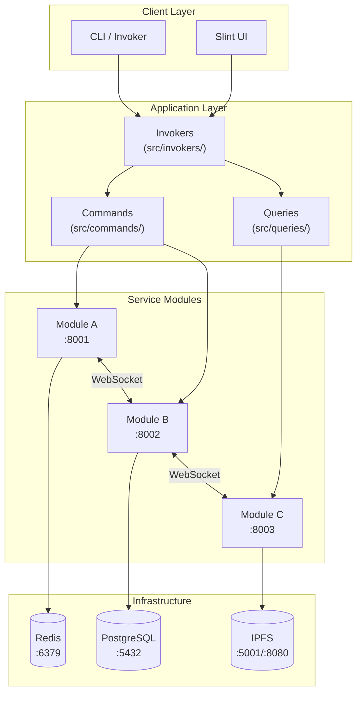
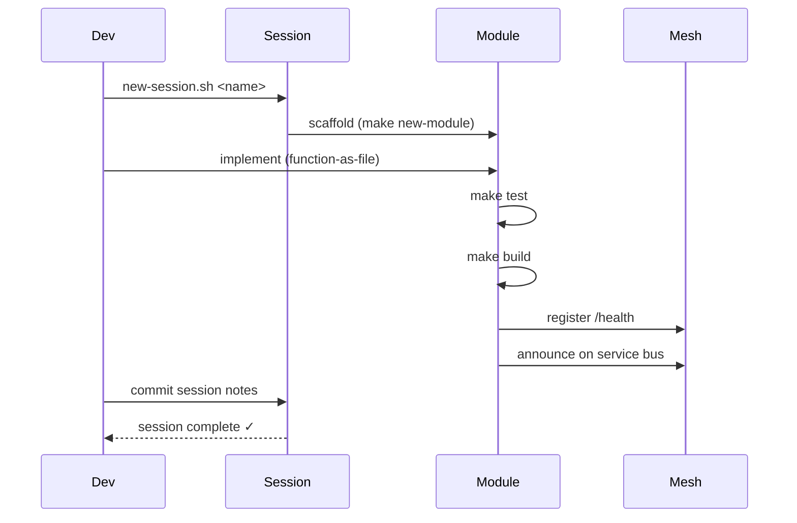
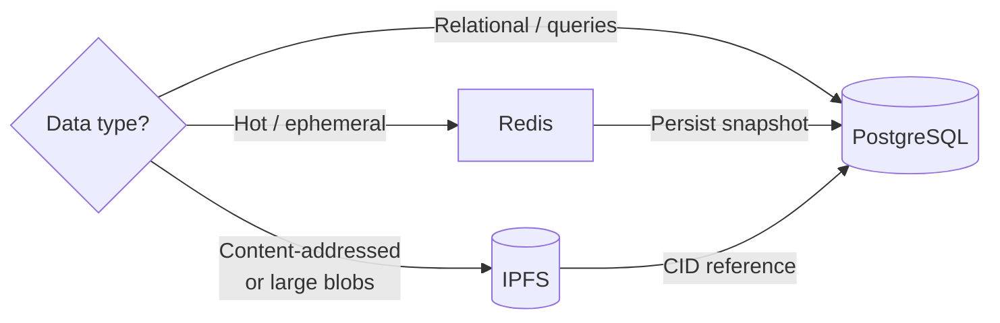
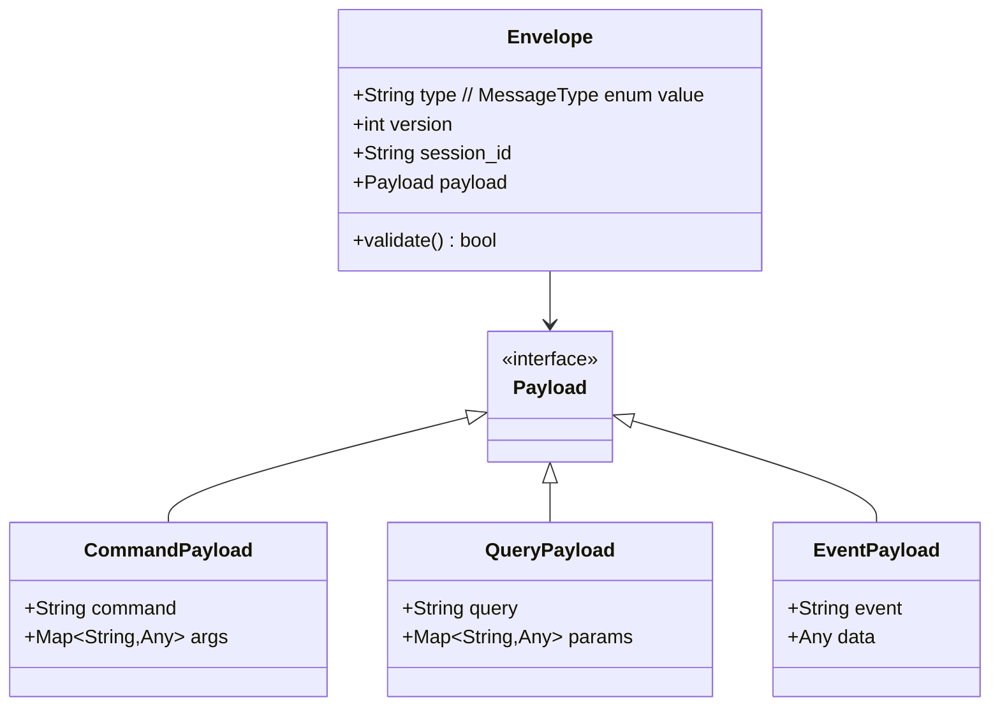

# Architecture Overview

## System Topology

```mermaid
graph TB
    subgraph Client["Client Layer"]
        UI["Slint UI"]
        CLI["CLI / Invoker"]
    end

    subgraph AppLayer["Application Layer"]
        direction LR
        CMD["Commands\n(src/commands/)"]
        QRY["Queries\n(src/queries/)"]
        INV["Invokers\n(src/invokers/)"]
    end

    subgraph Modules["Service Modules"]
        M1["Module A\n:8001"]
        M2["Module B\n:8002"]
        M3["Module C\n:8003"]
    end

    subgraph Infra["Infrastructure"]
        Redis[("Redis\n:6379")]
        PG[("PostgreSQL\n:5432")]
        IPFS[("IPFS\n:5001/:8080")]
    end

    UI --> INV
    CLI --> INV
    INV --> CMD
    INV --> QRY
    CMD --> M1
    CMD --> M2
    QRY --> M3
    M1 <-->|WebSocket| M2
    M2 <-->|WebSocket| M3
    M1 --> Redis
    M2 --> PG
    M3 --> IPFS
```

## Module Lifecycle

```mermaid
sequenceDiagram
    participant Dev
    participant Session
    participant Module
    participant Mesh

    Dev->>Session: new-session.sh <name>
    Session->>Module: scaffold (make new-module)
    Dev->>Module: implement (function-as-file)
    Module->>Module: make test
    Module->>Module: make build
    Module->>Mesh: register /health
    Module->>Mesh: announce on service bus
    Dev->>Session: commit session notes
    Session-->>Dev: session complete ✓
```

## Storage Routing

```mermaid
flowchart LR
    Data{Data type?}
    Data -->|"Hot / ephemeral"| Redis
    Data -->|"Relational / queries"| PG[(PostgreSQL)]
    Data -->|"Content-addressed\nor large blobs"| IPFS[(IPFS)]
    Redis -->|"Persist snapshot"| PG
    IPFS -->|"CID reference"| PG
```

## Communication Envelope

```mermaid
classDiagram
    class Envelope {
        +String type        // MessageType enum value
        +int version
        +String session_id
        +Payload payload
        +validate() bool
    }
    class Payload {
        <<interface>>
    }
    class CommandPayload {
        +String command
        +Map~String,Any~ args
    }
    class QueryPayload {
        +String query
        +Map~String,Any~ params
    }
    class EventPayload {
        +String event
        +Any data
    }

    Envelope --> Payload
    Payload <|-- CommandPayload
    Payload <|-- QueryPayload
    Payload <|-- EventPayload
```
