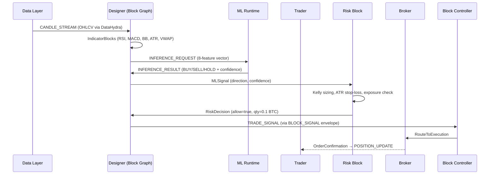
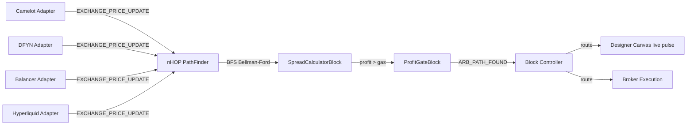
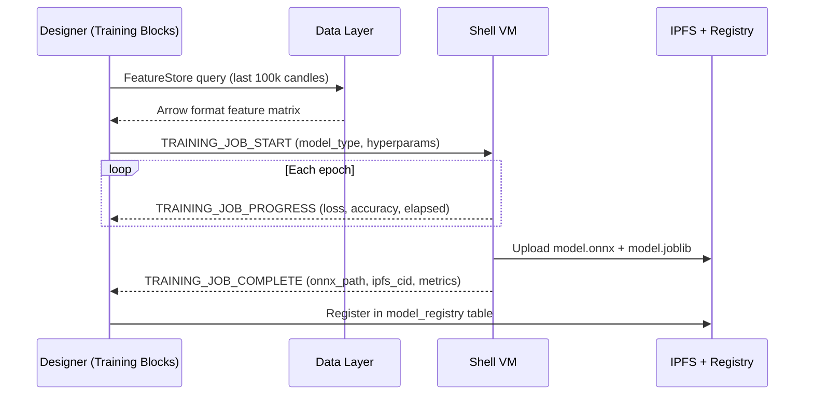
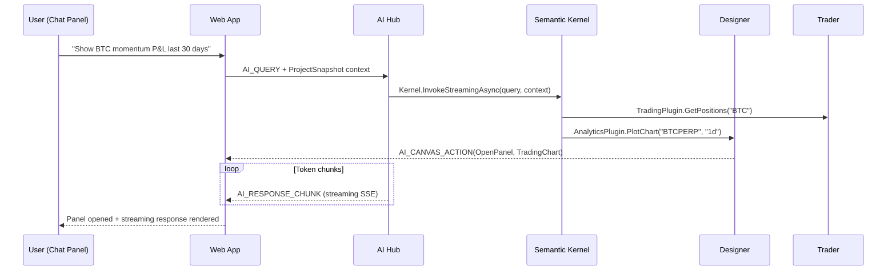

# MLS Platform — Giga-Scale Architecture Plan

> Cross-reference: [Session Schedule](../session-schedule.md) | [Module Topology](module-topology.md) | [Payload Schemas](../payload-schemas.md)

---

## Full System Architecture

```
╔══════════════════════════════════════════════════════════════════════════════════════════════╗
║                        MLS PLATFORM — FULL SYSTEM ARCHITECTURE                              ║
╠══════════════════════════════════════════════════════════════════════════════════════════════╣
║                                                                                              ║
║  ┌──────────────────────────────────────────────────────────────────────────────────────┐   ║
║  │                PRESENTATION LAYER (web-app :5200/:6200 · PWA/Chrome)                │   ║
║  │                                                                                      │   ║
║  │  ┌───────────────────────────────────────────────────────────────────────────────┐  │   ║
║  │  │                       MDI CANVAS (FluentUI Blazor)                            │  │   ║
║  │  │                                                                               │  │   ║
║  │  │  ┌──────────┐  ┌──────────┐  ┌──────────┐  ┌──────────┐  ┌────────────┐    │  │   ║
║  │  │  │ DESIGNER │  │ TRADING  │  │   ARB    │  │   DEFI   │  │ AI CHAT    │    │  │   ║
║  │  │  │ CANVAS   │  │ TERMINAL │  │ SCANNER  │  │ POSITIONS│  │ PANEL      │    │  │   ║
║  │  │  └──────────┘  └──────────┘  └──────────┘  └──────────┘  └────────────┘    │  │   ║
║  │  │                                                                               │  │   ║
║  │  │  ┌──────────┐  ┌──────────┐  ┌──────────┐  ┌──────────┐  ┌────────────┐    │  │   ║
║  │  │  │  ML      │  │  DATA    │  │ SHELL VM │  │ NETWORK  │  │ ENVELOPE   │    │  │   ║
║  │  │  │ RUNTIME  │  │ HYDRA    │  │ TERMINAL │  │ TOPOLOGY │  │ VIEWER     │    │  │   ║
║  │  │  └──────────┘  └──────────┘  └──────────┘  └──────────┘  └────────────┘    │  │   ║
║  │  └───────────────────────────────────────────────────────────────────────────────┘  │   ║
║  └──────────────────────────────────────────────────────────────────────────────────────┘   ║
║                                      │ SignalR/WS                                            ║
║  ┌──────────────────────────────────────────────────────────────────────────────────────┐   ║
║  │               ORCHESTRATION LAYER (block-controller :5100/:6100)                     │   ║
║  │                                                                                      │   ║
║  │  ModuleRegistry ── SubscriptionTable ── StrategyRouter ── SessionManager            │   ║
║  │  HeartbeatMonitor ── MessageBus ── EventBroadcaster ── LayoutStore                  │   ║
║  └───────────────────────┬─────────┬──────────┬──────────┬──────────┬──────────────────┘   ║
║                           │         │          │          │          │                       ║
║  ┌────────────────────────▼──┐ ┌────▼─────┐ ┌─▼───────┐ ┌▼────────┐ ┌▼──────────┐        ║
║  │  DESIGNER :5250/:6250     │ │ TRADER   │ │ARBITRAG.│ │  DEFI   │ │ML-RUNTIME │        ║
║  │                           │ │:5300/6300│ │:5400/640│ │:5500/650│ │:5600/6600 │        ║
║  │  BlockRegistry            │ │ ModelT   │ │ ModelA  │ │ ModelD  │ │ ONNX      │        ║
║  │  CompositionGraphs        │ │ RiskMgr  │ │ nHOP    │ │ Morpho  │ │ Roslyn    │        ║
║  │  StrategyPersistence      │ │ OrderMgr │ │ Camelot │ │ Balancer│ │ Training  │        ║
║  │  BacktestEngine           │ │ PosMgr   │ │ DFYN    │ │ Hyperliq│ │ IPFS Dist │        ║
║  └───────────────────────────┘ └──────────┘ └─────────┘ └─────────┘ └───────────┘        ║
║                                                                                              ║
║  ┌──────────────────────────────────────────────────────────────────────────────────────┐   ║
║  │          DATA LAYER :5700/:6700          AI-HUB :5750/:6750                          │   ║
║  │                                                                                      │   ║
║  │  HydraCollector ── FeedScheduler ── GapDetector ── FeatureEngineer                  │   ║
║  │  OpenAI · Anthropic · Google · Groq · OpenRouter · VercelAI · Local                 │   ║
║  │  ContextAssembler ── SK Plugins ── CanvasActionDispatcher                           │   ║
║  └──────────────────────────────────────────────────────────────────────────────────────┘   ║
║                                                                                              ║
║  ┌─────────────┐  ┌──────────────┐  ┌─────────────┐  ┌────────────────────────────────┐   ║
║  │ BROKER:5800 │  │TRANSACTIONS  │  │ SHELL-VM    │  │PostgreSQL · Redis · IPFS/Kubo  │   ║
║  │             │  │      :5900   │  │      :5950  │  │                                │   ║
║  └─────────────┘  └──────────────┘  └─────────────┘  └────────────────────────────────┘   ║
╚══════════════════════════════════════════════════════════════════════════════════════════════╝
```

---

## Data Flow Diagrams

### Trading Signal Flow



### Arbitrage nHOP Flow



### ML Training Lifecycle



### AI Hub Flow



---

## Designer Block Universe

### Block Domain Map

```
┌─────────────────────────────────────────────────────────────────────────────────┐
│                         MLS DESIGNER — 5 DOMAINS                                 │
├─────────────────┬──────────────┬──────────────┬──────────────┬───────────────── ┤
│  TRADING        │  ARBITRAGE   │  DEFI        │  ML TRAINING │  DATA HYDRA      │
│  COMPOSER       │  COMPOSER    │  COMPOSER    │  FLOW        │  CONNECTOR       │
├─────────────────┼──────────────┼──────────────┼──────────────┼──────────────────┤
│ DataSourceBlks  │ SpreadCalc   │ MorphoSupply │ DataLoader   │ FeedSource       │
│ IndicatorBlks   │ nHOPFinder   │ MorphoBorrow │ FeatureEngnr │ FilterBlock      │
│ MLBlocks        │ FlashLoan    │ BalancerSwap │ TrainSplit   │ NormalisationBlk │
│ StrategyBlks    │ ProfitGate   │ CollatHealth │ TrainModel   │ RouterBlock      │
│ RiskBlocks      │              │ YieldOptimzr │ ValidateModel│ BackfillBlock    │
│ ExecutionBlks   │              │ LiquidGuard  │ ExportONNX   │ GapMonitor       │
│                 │              │              │ HyperSearch  │                  │
└─────────────────┴──────────────┴──────────────┴──────────────┴──────────────────┘
```

### Socket Type Color Coding

| Socket Type | Color | Direction | Payload |
|-------------|-------|-----------|---------|
| `CandleStream` | Blue | → | `OHLCVCandle` |
| `IndicatorValue` | Cyan | → | `float` (normalised) |
| `MLSignal` | Purple | → | `ModelSignal { direction, confidence }` |
| `RiskDecision` | Orange | → | `RiskGate { allow, reason, quantity }` |
| `TradeOrder` | Green | → | `OrderRequest` |
| `OrderResult` | Green | ← | `FillConfirmation` |
| `ArbitrageOpp` | Yellow | → | `ArbOpp { spread, path, profit_usd }` |
| `DeFiSignal` | Teal | → | `YieldMove { protocol, action }` |
| `TrainingStatus` | Pink | → | `TrainResult { metrics, path }` |
| `ChartData` | White | → | `ChartUpdate { type, series }` |

---

## Performance Architecture

### L1–L4 Acceleration Applied Per Layer

| Layer | Technique | Target |
|-------|-----------|--------|
| Envelope routing | AVX2 SIMD topic hash, `ArrayPool<byte>`, `Span<byte>` | < 1µs median |
| Indicator computation | `System.Numerics.Vector<T>`, vectorised rolling windows | < 100ns per candle |
| ML Inference (C#) | `OrtValue` pre-allocated, GPU execution provider (CUDA) | < 10ms p95 |
| ML Inference (Python) | `torch.compile(mode="reduce-overhead")`, AMP bf16 | < 5ms |
| ML Training | L2: `DataLoader(num_workers=4)`, L4: AMP, DDP | maximal GPU utilisation |
| WebSocket I/O | Kestrel QUIC/HTTP3, `PipeReader`/`PipeWriter` zero-copy | < 5ms round-trip |
| DB queries | EF Core compiled queries, Npgsql pool=50, Redis pipeline | < 2ms p95 |

### Serialization Matrix

| Use Case | Format | Library |
|----------|--------|---------|
| Envelope wire protocol | MessagePack (binary) | MessagePack-CSharp |
| Strategy schema (storage) | JSON + versioned | System.Text.Json |
| ML feature matrices | Apache Arrow | PyArrow / Feather |
| ONNX artifacts | Binary | IPFS content-addressed |
| Redis cache entries | MessagePack | StackExchange.Redis + MP |
| Chrome extension messages | JSON | Native (browser) |

---

## StockSharp Alignment Matrix

| StockSharp Concept | MLS Equivalent | Notes |
|---|---|---|
| `BaseIndicator.OnProcess()` | `IndicatorBlock.ProcessAsync()` | Identical lifecycle: input → typed output, `IsFormed`, `Preload` for backtest |
| `CompositionDiagramElement` | `CompositeStrategyBlock` | Fractal nesting: disconnected inner sockets expose as outer ports |
| `ICompositionModel.GetDisconnectedSockets()` | `ICompositionGraph.GetExposedPorts()` | Same algorithm for exposing inner ports |
| `SettingsStorage` (Load/Save) | `JsonElement` + STJ source-gen | Strategy schema serialization for PostgreSQL |
| `IMessageAdapter` (Connectors/) | `IExchangeAdapter` | One class per exchange, pluggable data source |
| `AsyncMessageChannel` | `Channel<EnvelopePayload>` | Async message queue per module-to-module connection |
| `BaseSubscriptionMessage` | `SubscriptionRequest` payload | Typed subscription lifecycle |
| `IAnalyticsScript` + `IAnalyticsPanel` | `AnalyticsBlock` + `ChartExportBlock` | Script-driven analytics → canvas chart panels |
| Algo.Compilation (Roslyn) | `MLS.Designer.Compilation.IStrategyCompiler` | Live C# compilation of custom blocks |
| `IndicatorProvider` | `BlockRegistry` | Central catalog of all available block types |
| `UndoManager` in CompositionModel | `CompositionGraph.UndoManager` | Full undo/redo for designer graph edits |
| `DiagramSocketType` enum | `BlockSocketType` enum | Strongly-typed socket connections |
| `Strategy.Params` / `StrategyParam<T>` | `BlockParameter<T>` | Typed, serializable, optimizable block parameters |
| `Designer.Templates/` JSON | `designer-templates/*.json` | Pre-built strategy schemas |
| `Algo.Testing` BacktestEngine | `MLS.Designer.Execution.BacktestEngine` | Historical replay through block graph |

---

## See Also

- [Session Schedule](../session-schedule.md) — complete 22-session implementation guide
- [Designer Block Graph](designer-block-graph.md) — full block type hierarchy
- [AI Hub Providers](ai-hub-providers.md) — multi-provider AI architecture
- [Canvas MDI Layout](canvas-mdi-layout.md) — MDI window manager + PWA
- [Hydra Data Collection](hydra-data-collection.md) — exchange feed architecture
- [Exchange Adapters](exchange-adapters.md) — Arbitrum DEX adapters
- [Performance Semantics](performance-semantics.md) — L1–L4 acceleration details
- [Module Topology](module-topology.md) — updated port allocation and network graph
- [Payload Schemas](../payload-schemas.md) — all envelope types with JSON examples
