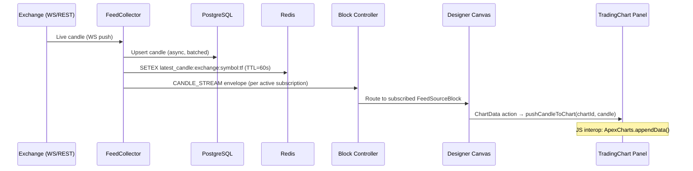

# Hydra Data Collection Architecture

> **Reference**: [Giga-Scale Plan](giga-scale-plan.md) | [Session Schedule](../session-schedule.md) (Sessions 07, 15–16)

---

## Overview

The Hydra Data Collection system provides continuous market data ingestion from all supported exchanges into the MLS platform storage stack (PostgreSQL → Redis L1 cache → IPFS for large historical archives). It is the MLS equivalent of the StockSharp Hydra application.

```
  [External Sources]           [Hydra Collection Engine]          [Storage + Consumers]
  ─────────────────            ─────────────────────────          ─────────────────────
  HYPERLIQUID WS ──────────►  CandleCollectorJob              ►  PostgreSQL candles
  Camelot Subgraph ─────────►  TradeTickCollector              ►  Redis L1 cache (latest 200 candles)
  Arbitrum event logs ──────►  OnChainEventCollector           ►  IPFS large archives (>30 days)
  DFYN REST API ────────────►  OrderBookSnapshotJob            ►
  Morpho API ───────────────►  DeFiStateCollector              ►  Feature Store (computed)
                                                                ►  Designer canvas (real-time)
                                                                ►  Strategy block graphs
```

---

## Data Hydra Domain Blocks (Designer Integration)

```
Blocks/DataHydra/
├── FeedSourceBlock        Subscribe exchange → output CandleStream socket
│     Parameters: exchange, symbol, timeframe, max_gap_seconds
│
├── FilterBlock            Filter incoming candles by criteria
│     Parameters: min_volume, min_price, exclude_weekends
│
├── NormalisationBlock     Normalise OHLCV to MLS standard schema
│     Handles: timezone conversion, decimal precision, exchange-specific quirks
│
├── RouterBlock            Route to: chart panel OR strategy block graph
│     Parameters: route_to_chart (bool), route_to_strategy (bool), strategy_id
│
├── BackfillBlock          Trigger REST backfill for a date range
│     Parameters: from_date, to_date, batch_size
│
└── GapMonitorBlock        Monitor for data gaps, emit DATA_GAP_DETECTED
      Parameters: detection_interval_seconds, gap_tolerance_pct (default 5%)
```

---

## Feed Collection Architecture

### FeedCollector Base Class

```csharp
/// <summary>Base class for all exchange feed collection loops.</summary>
public abstract class FeedCollector(
    ICandleRepository _repo,
    IRedisCache _cache,
    IEnvelopePublisher _publisher,
    ILogger _logger
) : BackgroundService
{
    protected abstract string ExchangeId { get; }
    protected abstract Task ConnectAsync(CancellationToken ct);
    protected abstract IAsyncEnumerable<OHLCVCandle> StreamCandlesAsync(
        string symbol, string timeframe, CancellationToken ct);

    /// L2 + L3: Channel<OHLCVCandle> per (symbol, timeframe) for fan-out
    private readonly Channel<OHLCVCandle> _ingestChannel =
        Channel.CreateBounded<OHLCVCandle>(
            new BoundedChannelOptions(4096) { FullMode = BoundedChannelFullMode.DropOldest });

    protected override async Task ExecuteAsync(CancellationToken ct)
    {
        // 1. Connect with exponential backoff
        // 2. Stream candles → _ingestChannel
        // 3. Consumer: persist to PostgreSQL + update Redis + emit CANDLE_STREAM envelope
    }
}
```

### Supported Collectors

| Collector | Exchange | Method | Data Types |
|-----------|----------|--------|------------|
| `HyperliquidFeedCollector` | HYPERLIQUID | WebSocket | OHLCV, trades, order book |
| `CamelotFeedCollector` | Camelot DEX | Subgraph GraphQL | OHLCV (aggregated swaps) |
| `DFYNFeedCollector` | DFYN | REST API (polling) | OHLCV |
| `BalancerFeedCollector` | Balancer | Subgraph GraphQL | Pool price, liquidity |
| `MorphoFeedCollector` | Morpho | REST API | Lending rates, utilization |
| `ArbitrumEventCollector` | Arbitrum L2 | Nethereum WS | On-chain swap events |

---

## Gap Detection Pipeline

### Algorithm

```csharp
public sealed class GapDetector(
    ICandleRepository _repo,
    IBackfillPipeline _backfill,
    IEnvelopePublisher _publisher,
    ILogger<GapDetector> _logger
) : BackgroundService
{
    private static readonly TimeSpan DetectionInterval = TimeSpan.FromMinutes(1);

    protected override async Task ExecuteAsync(CancellationToken ct)
    {
        while (!ct.IsCancellationRequested)
        {
            await DetectAndQueueGapsAsync(ct);
            await Task.Delay(DetectionInterval, ct);
        }
    }

    private async Task DetectAndQueueGapsAsync(CancellationToken ct)
    {
        var activeFeeds = await _repo.GetActiveFeedsAsync(ct);

        await Parallel.ForEachAsync(activeFeeds, ct, async (feed, innerCt) =>
        {
            var (exchange, symbol, timeframe) = feed;
            var latestStored = await _repo.GetLatestCandleTimeAsync(exchange, symbol, timeframe, innerCt);
            if (latestStored is null) return;

            var expected = (DateTimeOffset.UtcNow - latestStored.Value).TotalSeconds
                           / TimeframeToSeconds(timeframe);
            var actual = await _repo.CountCandlesSinceAsync(exchange, symbol, timeframe, latestStored.Value, innerCt);

            if (actual < expected * 0.95)  // 5% tolerance
            {
                var gap = new DataGap(exchange, symbol, timeframe, latestStored.Value, DateTimeOffset.UtcNow);
                await _publisher.PublishAsync(MessageTypes.DataGapDetected, gap, innerCt);
                await _backfill.EnqueueAsync(gap, innerCt);
                _logger.LogWarning("Gap detected: {Exchange} {Symbol} {TF} from {Start}", exchange, symbol, timeframe, latestStored);
            }
        });
    }
}
```

### Backfill Pipeline

```
BackfillPipeline:

1. Receive DataGap { exchange, symbol, timeframe, start, end }
2. Divide into REST-API-friendly chunks (max 1000 candles per request)
3. For each chunk:
   a. Call exchange REST API (rate-limited via SemaphoreSlim)
   b. Upsert candles to PostgreSQL (ON CONFLICT DO NOTHING)
   c. Update Redis cache if within last 200 candles
4. When all chunks complete: emit DATA_GAP_FILLED envelope
5. On failure after 3 retries: emit DATA_GAP_FAILED with reason
```

---

## Data Flow: Feed → Chart



---

## Feature Store

### Schema

```sql
CREATE TABLE feature_store (
    id              UUID PRIMARY KEY DEFAULT gen_random_uuid(),
    exchange        VARCHAR(50) NOT NULL,
    symbol          VARCHAR(50) NOT NULL,
    timeframe       VARCHAR(10) NOT NULL,
    model_type      VARCHAR(20) NOT NULL,   -- 'model-t', 'model-a', 'model-d'
    schema_version  INTEGER NOT NULL,
    computed_at     TIMESTAMPTZ NOT NULL,
    open_time       TIMESTAMPTZ NOT NULL,
    features        FLOAT8[] NOT NULL,      -- fixed-length feature vector
    UNIQUE (exchange, symbol, timeframe, model_type, schema_version, open_time)
);

CREATE INDEX idx_feature_store_query ON feature_store
    (exchange, symbol, timeframe, model_type, schema_version, open_time DESC);
```

### FeatureEngineer (C# — Vectorised L1)

```csharp
public sealed class FeatureEngineer
{
    /// <summary>
    /// Compute model-t 8-feature vector for a 200-candle window.
    /// Target: &lt; 1ms. Uses System.Numerics.Vector&lt;float&gt; AVX2 acceleration.
    /// </summary>
    public FeatureVector ComputeModelT(ReadOnlySpan<OHLCVCandle> window)
    {
        // Feature 0: RSI(14) normalised [0,1]
        // Feature 1: MACD signal (z-score normalised)
        // Feature 2: Bollinger Band position [0,1]
        // Feature 3: Volume delta (vs 20-period avg, z-score)
        // Feature 4: Momentum(20) z-score
        // Feature 5: ATR(14) z-score
        // Feature 6: Spread in basis points
        // Feature 7: Distance from VWAP z-score
        // All in one vectorised pass — no Python dependency
    }

    public FeatureVector ComputeModelA(ReadOnlySpan<OHLCVCandle> window, ExchangePricePair prices) { }
    public FeatureVector ComputeModelD(DeFiStateSnapshot state) { }
}
```

---

## Data Storage Stack

| Store | What is stored | Retention | Access pattern |
|-------|----------------|-----------|---------------|
| PostgreSQL `candles` | All OHLCV data | Unlimited | Historical queries, feature engineering |
| PostgreSQL `feature_store` | Pre-computed feature vectors | Model schema lifetime | Training data loading |
| Redis `latest_candle:*` | Latest 200 candles per feed | 60s TTL rolling | Real-time indicator blocks (L1 fast path) |
| IPFS/Kubo | Full historical archives > 30 days, ONNX artifacts | Content-addressed, permanent | Training pipeline, model distribution |

### PostgreSQL Candles Schema

```sql
CREATE TABLE candles (
    id          UUID PRIMARY KEY DEFAULT gen_random_uuid(),
    exchange    VARCHAR(50) NOT NULL,
    symbol      VARCHAR(50) NOT NULL,
    timeframe   VARCHAR(10) NOT NULL,
    open_time   TIMESTAMPTZ NOT NULL,
    open        DECIMAL(20,8) NOT NULL,
    high        DECIMAL(20,8) NOT NULL,
    low         DECIMAL(20,8) NOT NULL,
    close       DECIMAL(20,8) NOT NULL,
    volume      DECIMAL(20,8) NOT NULL,
    trade_count INTEGER,
    UNIQUE (exchange, symbol, timeframe, open_time)
) PARTITION BY RANGE (open_time);

-- Monthly partitions, created automatically
CREATE TABLE candles_2026_01 PARTITION OF candles
    FOR VALUES FROM ('2026-01-01') TO ('2026-02-01');
```

---

## Configuration

```json
{
  "DataLayer": {
    "Hydra": {
      "EnabledExchanges": ["hyperliquid", "camelot", "dfyn", "balancer", "morpho"],
      "GapDetection": {
        "IntervalSeconds": 60,
        "TolerancePercent": 5.0
      },
      "Backfill": {
        "MaxConcurrentJobs": 4,
        "ChunkSize": 1000,
        "RateLimitPerSecond": 5,
        "MaxRetries": 3,
        "BackoffBaseMs": 1000
      },
      "Redis": {
        "CandleCacheTTLSeconds": 60,
        "MaxCachedCandlesPerFeed": 200
      }
    }
  }
}
```

---

## See Also

- [Session Schedule — Sessions 07, 15, 16](../session-schedule.md#phase-4--hydra-data-collection)
- [Exchange Adapters](exchange-adapters.md) — how each exchange connects to Hydra
- [Designer Block Graph](designer-block-graph.md) — Data Hydra domain blocks
