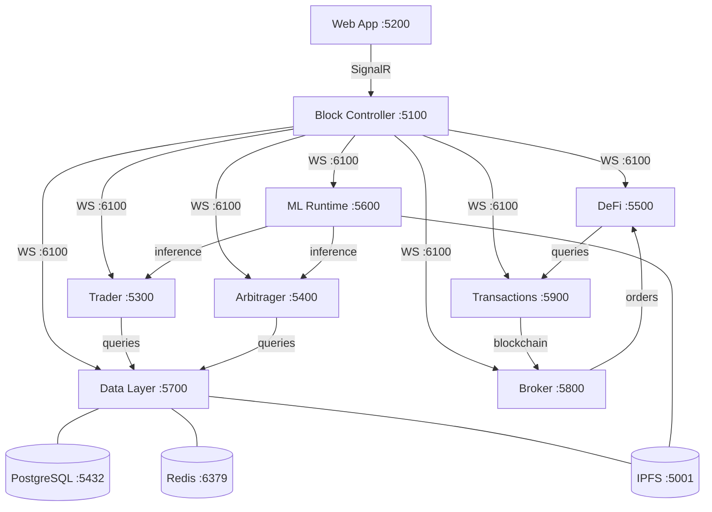
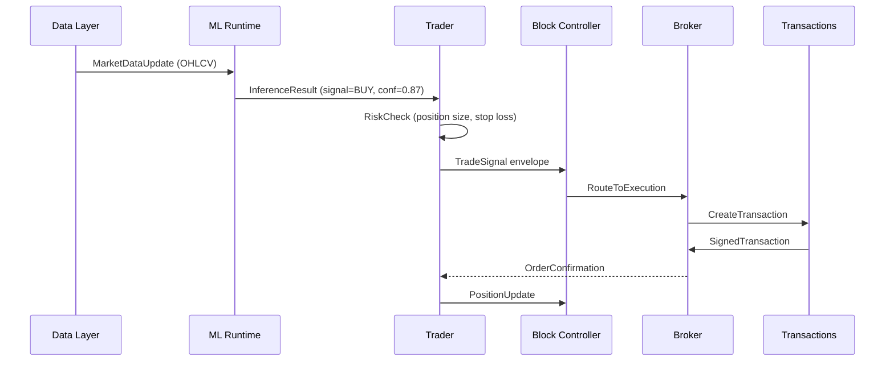

# Module Network Topology

## Overview

The MLS platform uses a hub-and-spoke network topology with Block Controller as the central orchestration hub.

## Network Diagram



## Port Allocation

| Module | HTTP API | WebSocket | Container Port |
|--------|----------|-----------|----------------|
| block-controller | 5100 | 6100 | 5100, 6100 |
| web-app | 5200 | 6200 | 5200 |
| trader | 5300 | 6300 | 5300, 6300 |
| arbitrager | 5400 | 6400 | 5400, 6400 |
| defi | 5500 | 6500 | 5500, 6500 |
| ml-runtime | 5600 | 6600 | 5600, 6600 |
| data-layer | 5700 | 6700 | 5700, 6700 |
| broker | 5800 | 6800 | 5800, 6800 |
| transactions | 5900 | 6900 | 5900, 6900 |

## Envelope Protocol

All inter-module messages use this JSON envelope:

```json
{
  "type": "TRADE_SIGNAL",
  "version": 1,
  "session_id": "550e8400-e29b-41d4-a716-446655440000",
  "module_id": "trader-550e8400",
  "timestamp": "2024-01-15T10:30:00.000Z",
  "payload": {
    "symbol": "BTC-PERP",
    "side": "BUY",
    "price": 42000.50,
    "confidence": 0.87
  }
}
```

## Message Flow: Trade Execution


