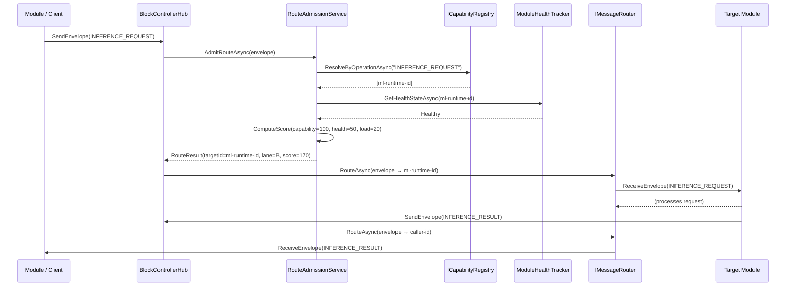
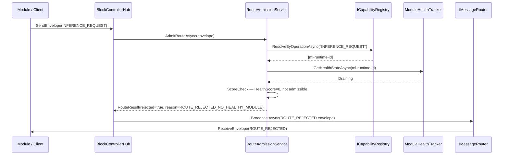
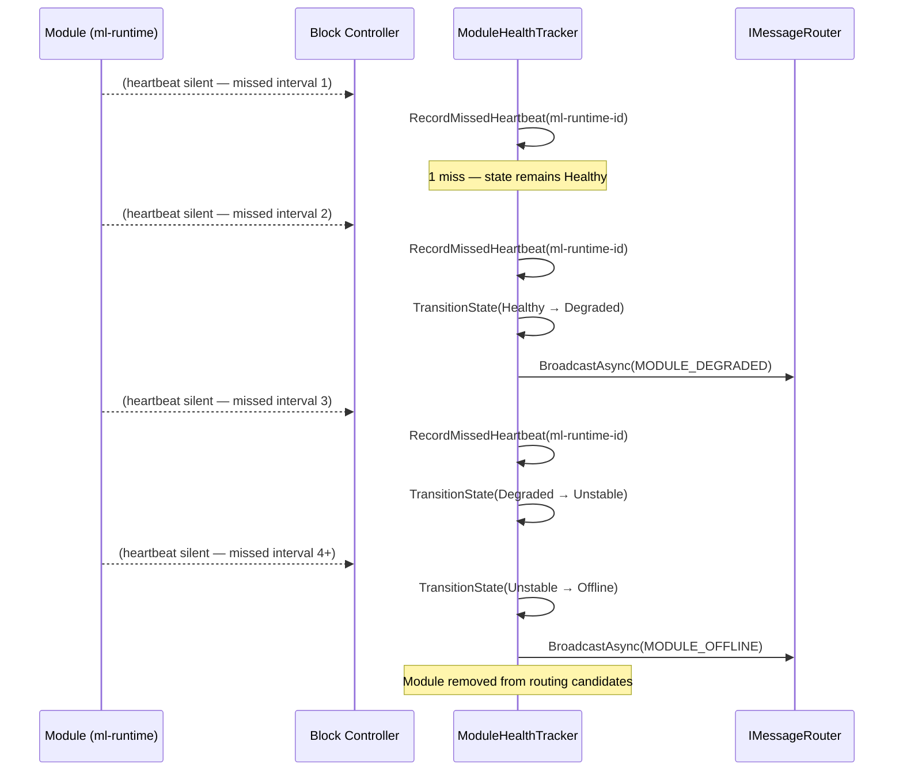
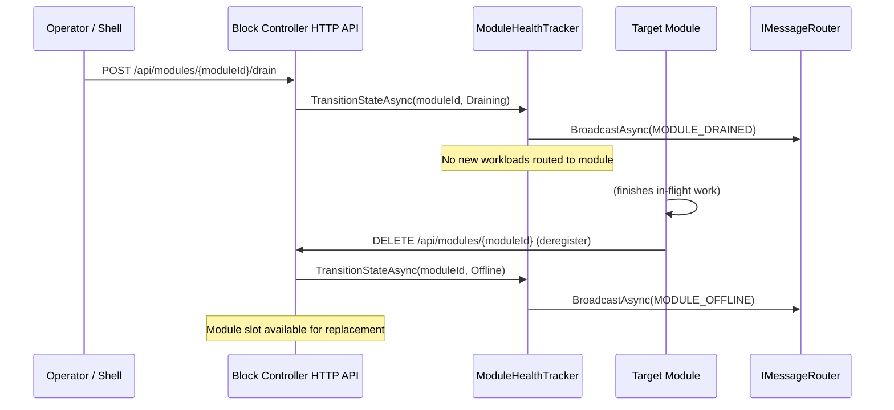
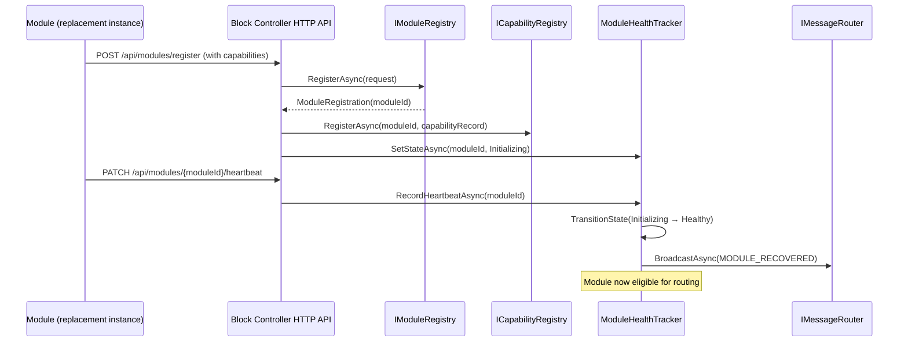

# Execution Governor Sequence Diagrams
## BCG Session 02 — Route, Dispatch, Fail, and Drain Sequences

> **Status**: ✅ Active  
> **Last Updated**: Session 02  
> **Owned by**: Block Controller (block-controller)

## 1. Purpose

This document provides Mermaid sequence diagrams for the four primary execution governance flows: standard route, route rejection, module degradation, and graceful drain.

## 2. Standard Route Flow

## 3. Route Rejection Flow

## 4. Heartbeat Failure and Degradation Flow

## 5. Graceful Drain Flow

## 6. Module Recovery Flow

## 7. References

- `routing-policy-spec.md` — route scoring and admission rules
- `health-escalation-model.md` — state machine details
- `module-capability-registry-spec.md` — capability declaration
- `src/block-controller/MLS.BlockController/Services/RouteAdmissionService.cs` — implementation
