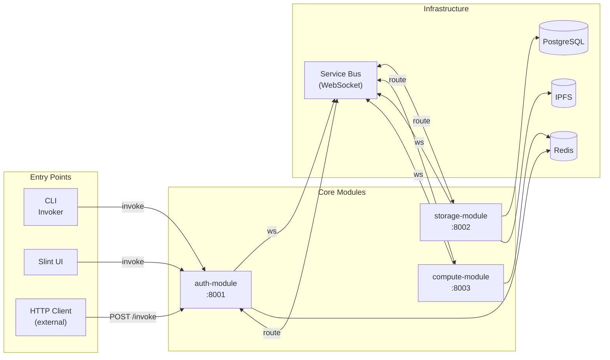
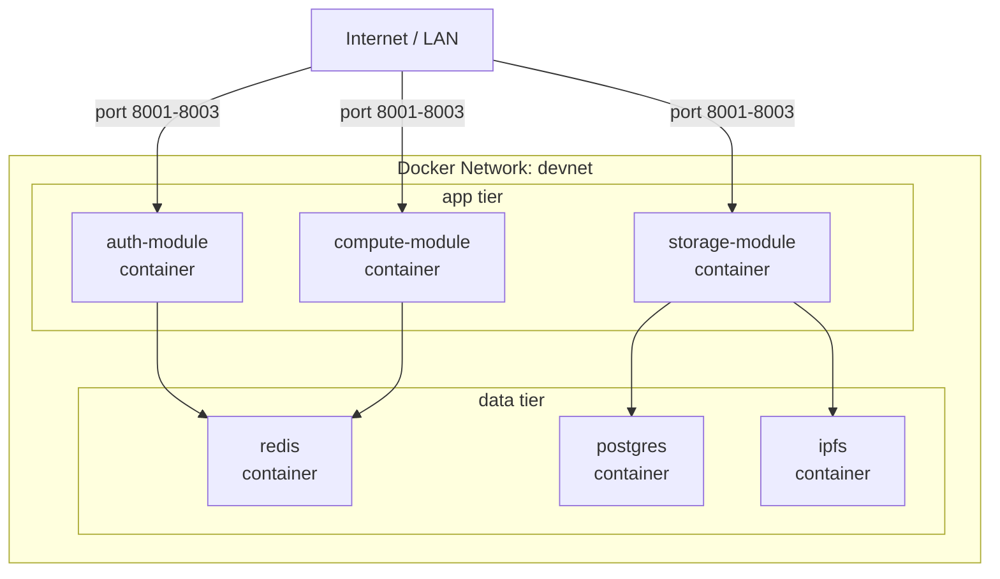

# Module Interaction Graph

```mermaid
graph LR
    subgraph "Entry Points"
        CLI["CLI\nInvoker"]
        UI["Slint UI"]
        HTTP["HTTP Client\n(external)"]
    end

    subgraph "Core Modules"
        AUTH["auth-module\n:8001"]
        STORAGE["storage-module\n:8002"]
        COMPUTE["compute-module\n:8003"]
    end

    subgraph "Infrastructure"
        REDIS[("Redis")]
        PG[("PostgreSQL")]
        IPFS[("IPFS")]
        BUS["Service Bus\n(WebSocket)"]
    end

    CLI -->|invoke| AUTH
    UI  -->|invoke| AUTH
    HTTP -->|POST /invoke| AUTH
    AUTH -->|ws| BUS
    STORAGE -->|ws| BUS
    COMPUTE -->|ws| BUS
    BUS <-->|route| AUTH
    BUS <-->|route| STORAGE
    BUS <-->|route| COMPUTE
    AUTH --> REDIS
    STORAGE --> PG
    STORAGE --> IPFS
    COMPUTE --> REDIS
```

# Deployment Topology

```mermaid
graph TB
    subgraph "Docker Network: devnet"
        subgraph "app tier"
            authC["auth-module\ncontainer"]
            storC["storage-module\ncontainer"]
            compC["compute-module\ncontainer"]
        end
        subgraph "data tier"
            redisC["redis\ncontainer"]
            pgC["postgres\ncontainer"]
            ipfsC["ipfs\ncontainer"]
        end
    end
    Internet["Internet / LAN"] -->|port 8001-8003| authC & storC & compC
    authC --> redisC
    storC --> pgC
    storC --> ipfsC
    compC --> redisC
```
