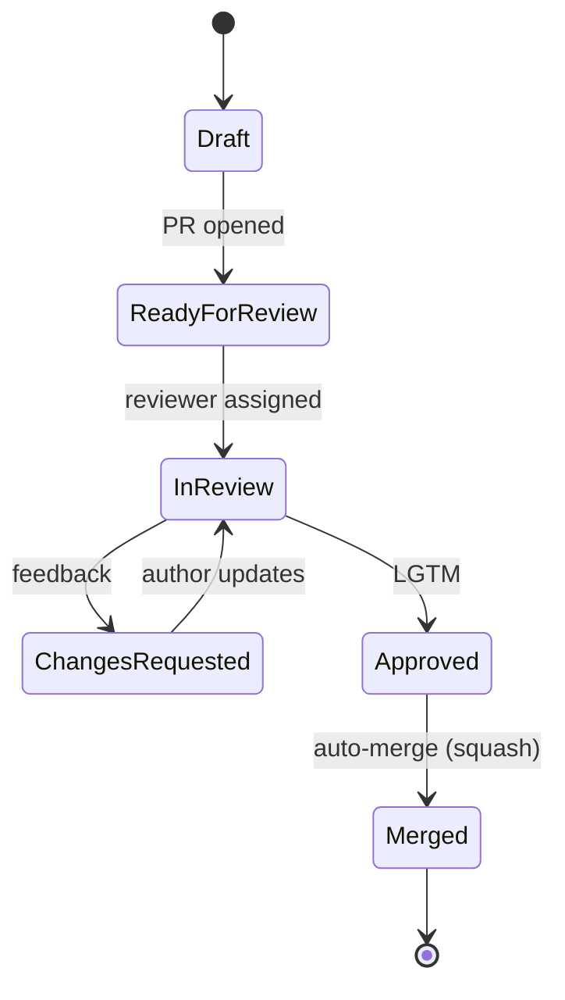

# Review Guide

## Pull Request Checklist

### Code Quality
- [ ] Functions follow the **Function-as-File** rule.
- [ ] All public APIs have doc-comments.
- [ ] No magic strings — enums/constants used throughout.
- [ ] Payload types extend the `Envelope` pattern.
- [ ] No direct DB access outside `src/storage/`.

### Module Completeness
- [ ] Module compiles/runs standalone (`make run MODULE=<name>`).
- [ ] `GET /health` returns `200 OK`.
- [ ] Module registers on the service mesh.
- [ ] Unit tests pass (`make test-module MODULE=<name>`).
- [ ] Session notes committed to `sessions/<session-id>/`.

### Security
- [ ] No secrets committed (checked via `git-secrets` or equivalent).
- [ ] Input validated at API boundary with typed payloads.
- [ ] SQL uses parameterised queries only.

### Infrastructure
- [ ] Docker Compose services declared in `infra/docker-compose.yml`.
- [ ] Environment variables documented in `.env.example`.

---

## Review Graph (lifecycle)



## Commit Convention

```
<type>(<scope>): <short summary>

Types: feat | fix | docs | refactor | test | chore | ci
Scope: module name, infra, session, storage, etc.

Examples:
  feat(auth): add JWT invoker
  fix(storage): handle Redis connection timeout
  docs(sessions): add session-02 notes
  ci(workflows): add dynamic merge gate
```

## Diagram Standards

All architecture diagrams in `docs/graphs/` use **Mermaid** syntax so they render in GitHub Markdown. Reference them from doc pages with:

```markdown
[Diagram](graphs/<name>.md)
```
