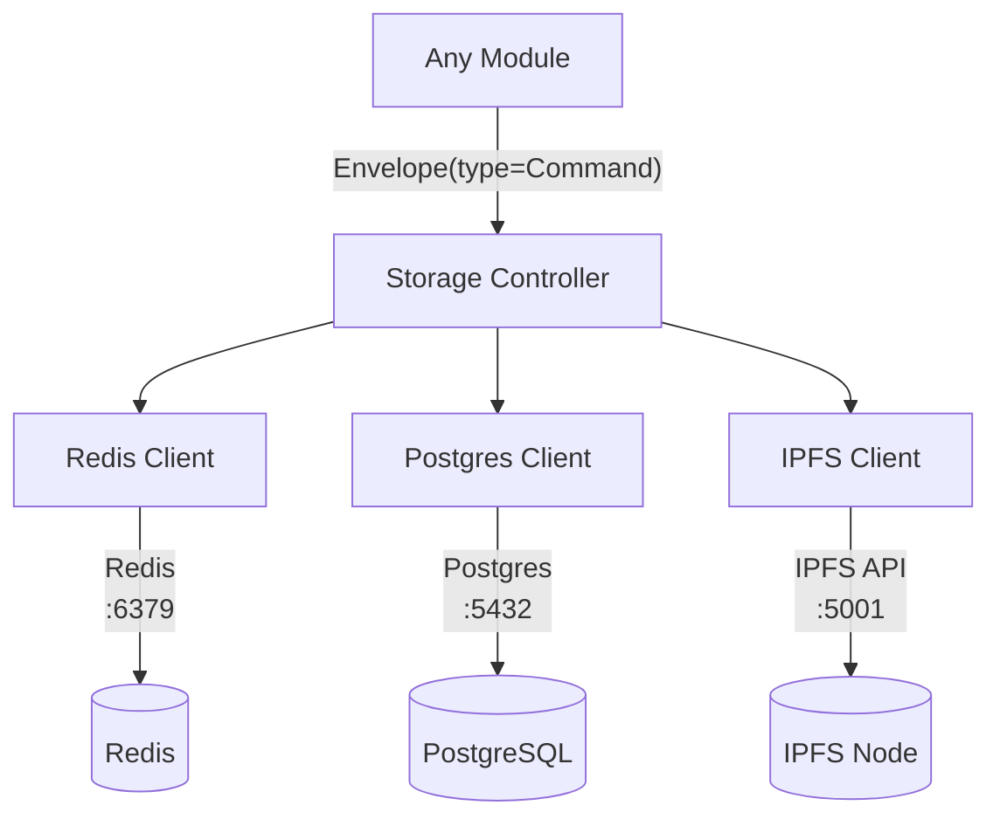

# Storage Controller

## Overview
The Storage Controller is the single authoritative layer for all read/write operations. No module accesses databases directly — they call the controller via the internal service bus.

## Storage Backends

| Backend    | Use Case                                    | Access Pattern          |
|------------|---------------------------------------------|-------------------------|
| Redis      | Session cache, pub/sub, rate limiting       | Key-Value, Streams      |
| PostgreSQL | Relational data, user records, event log    | SQL queries             |
| IPFS       | Content-addressed blobs, large files, media | CID get/put             |

## Directory Layout

```
src/
  storage/
    controller.rs / controller.py  ← single entry point
    backends/
      redis.rs / redis.py          ← Redis adapter
      postgres.rs / postgres.py    ← Postgres adapter
      ipfs.rs / ipfs.py            ← IPFS HTTP client
    models/                        ← shared data models
    migrations/                    ← SQL migration files
```

## Controller API (canonical commands)

### Commands (write)
| Command                | Backend    | Description                    |
|------------------------|------------|--------------------------------|
| `storage::put`         | IPFS       | Store a blob, return CID       |
| `storage::set`         | Redis      | Set a key-value pair           |
| `storage::insert`      | Postgres   | Insert a record                |
| `storage::update`      | Postgres   | Update a record                |
| `storage::delete`      | Postgres   | Soft-delete a record           |
| `storage::cache_set`   | Redis      | Set with TTL                   |
| `storage::publish`     | Redis      | Publish to a channel           |

### Queries (read)
| Query                  | Backend    | Description                    |
|------------------------|------------|--------------------------------|
| `storage::get`         | IPFS       | Retrieve content by CID        |
| `storage::fetch`       | Redis      | Get a key value                |
| `storage::select`      | Postgres   | Run a parameterised query      |
| `storage::cache_get`   | Redis      | Get cached value               |
| `storage::subscribe`   | Redis      | Subscribe to a channel         |

## Data Flow Diagram



## Redis Key Schema

```
<module>:<entity>:<id>            # entity cache
session:<session_id>:state        # session state
ratelimit:<user_id>:<action>      # rate limiter
pubsub:<channel>                  # pub/sub channel
lock:<resource>                   # distributed lock
```

## Postgres Conventions

- All tables have `id UUID PRIMARY KEY DEFAULT gen_random_uuid()`.
- All tables have `created_at TIMESTAMPTZ NOT NULL DEFAULT NOW()`.
- Soft-delete via `deleted_at TIMESTAMPTZ`.
- Migrations in `src/storage/migrations/` named `NNNN_description.sql`.

## IPFS Conventions

- Store only content-addressed data (blobs, files, media).
- Always pin CIDs that must survive garbage collection.
- Reference CIDs in Postgres via a `cid TEXT` column on relevant tables.
